# Okteto + AWS Development Environment Architecture

## Overview
This architecture demonstrates a cloud-native development environment that spans across Okteto (Kubernetes) and AWS cloud services. The application is "The Oktaco Shop" - a food ordering system built with polyglot microservices.

## Architecture Diagram

```mermaid
graph TB
    subgraph "User Layer"
        USER[👤 Developer]
        BROWSER[🌐 Web Browser]
    end

    subgraph "Development Tools"
        OKTETO_CLI[⚡ Okteto CLI]
        TERRAFORM[🏗️ Terraform]
    end

    subgraph "Okteto Cloud Platform"
        subgraph "Kubernetes Cluster"
            subgraph "Okteto Namespace"
                subgraph "Menu Service"
                    MENU_POD[📱 Menu Pod<br/>Node.js + Express<br/>Port: 3000]
                    MENU_SVC[Menu Service]
                    MENU_INGRESS[Menu Ingress<br/>menu-namespace.domain]
                end
                
                subgraph "Kitchen Service"
                    KITCHEN_POD[🍳 Kitchen Pod<br/>Go + Gin<br/>Port: 8000]
                    KITCHEN_SVC[Kitchen Service]
                    KITCHEN_INGRESS[Kitchen Ingress<br/>kitchen-namespace.domain]
                end
                
                subgraph "Check Service"
                    CHECK_POD[🧾 Check Pod<br/>Python + FastAPI<br/>Port: 8000]
                    CHECK_SVC[Check Service]
                    CHECK_INGRESS[Check Ingress<br/>check-namespace.domain]
                end
                
                subgraph "Testing"
                    E2E_POD[🧪 E2E Tests<br/>Playwright]
                end
                
                AWS_SECRET[🔐 AWS Credentials Secret]
                TF_STATE[📦 Terraform State<br/>Kubernetes Backend]
            end
        end
    end

    subgraph "AWS Cloud Services"
        subgraph "SQS"
            SQS_QUEUE[📬 SQS Queue<br/>namespace-oktacoshop]
        end
        
        subgraph "S3"
            S3_BUCKET[🪣 S3 Bucket<br/>namespace-oktacoshop<br/>Receipts Storage]
        end
        
        subgraph "AWS Management"
            SQS_CONSOLE[🖥️ SQS Console]
            S3_CONSOLE[🖥️ S3 Console]
        end
    end

    %% User Interactions
    USER -.-> OKTETO_CLI
    USER -.-> BROWSER
    BROWSER --> MENU_INGRESS
    BROWSER --> KITCHEN_INGRESS
    BROWSER --> CHECK_INGRESS

    %% Development Workflow
    OKTETO_CLI --> TERRAFORM
    TERRAFORM --> AWS_SECRET
    TERRAFORM --> SQS_QUEUE
    TERRAFORM --> S3_BUCKET
    TERRAFORM -.-> TF_STATE
    
    OKTETO_CLI --> MENU_POD
    OKTETO_CLI --> KITCHEN_POD
    OKTETO_CLI --> CHECK_POD
    OKTETO_CLI --> E2E_POD

    %% Service Communication
    MENU_INGRESS --> MENU_SVC
    MENU_SVC --> MENU_POD
    
    KITCHEN_INGRESS --> KITCHEN_SVC
    KITCHEN_SVC --> KITCHEN_POD
    
    CHECK_INGRESS --> CHECK_SVC
    CHECK_SVC --> CHECK_POD

    %% AWS Integration
    MENU_POD -.->|Send Orders| SQS_QUEUE
    KITCHEN_POD -.->|Poll Orders| SQS_QUEUE
    KITCHEN_POD -.->|Send Ready Status| CHECK_POD
    CHECK_POD -.->|Upload Receipts| S3_BUCKET

    %% Management Consoles
    SQS_QUEUE -.-> SQS_CONSOLE
    S3_BUCKET -.-> S3_CONSOLE

    %% Styling
    classDef okteto fill:#1f77b4,stroke:#fff,stroke-width:2px,color:#fff
    classDef aws fill:#ff7f0e,stroke:#fff,stroke-width:2px,color:#fff
    classDef user fill:#2ca02c,stroke:#fff,stroke-width:2px,color:#fff
    classDef tools fill:#d62728,stroke:#fff,stroke-width:2px,color:#fff

    class MENU_POD,KITCHEN_POD,CHECK_POD,E2E_POD,MENU_SVC,KITCHEN_SVC,CHECK_SVC,MENU_INGRESS,KITCHEN_INGRESS,CHECK_INGRESS,AWS_SECRET,TF_STATE okteto
    class SQS_QUEUE,S3_BUCKET,SQS_CONSOLE,S3_CONSOLE aws
    class USER,BROWSER user
    class OKTETO_CLI,TERRAFORM tools
```

## Component Details

### 🎯 **Running in Okteto (Kubernetes)**

#### **Microservices:**
1. **Menu Service** (Node.js/Express)
   - **Purpose**: Frontend for placing food orders
   - **Port**: 3000
   - **Endpoint**: `https://menu-{namespace}.{domain}`
   - **Function**: Displays menu, accepts orders, sends to SQS queue

2. **Kitchen Service** (Go/Gin)
   - **Purpose**: Kitchen order processing system
   - **Port**: 8000
   - **Endpoint**: `https://kitchen-{namespace}.{domain}`
   - **Function**: Polls SQS for orders, marks items as ready, notifies Check service

3. **Check Service** (Python/FastAPI)
   - **Purpose**: Receipt generation and storage
   - **Port**: 8000
   - **Endpoint**: `https://check-{namespace}.{domain}`
   - **Function**: Generates receipts, uploads to S3, provides download links

4. **E2E Tests** (Playwright)
   - **Purpose**: End-to-end testing of the complete application flow
   - **Function**: Validates UI functionality across all services

#### **Infrastructure Components:**
- **AWS Credentials Secret**: Stores AWS access keys for service authentication
- **Terraform State**: Stored in Kubernetes backend for infrastructure state management
- **Ingress Controllers**: Automatic HTTPS endpoints with Okteto domain

### ☁️ **Running on AWS**

#### **Managed Services:**
1. **SQS Queue**: `{namespace}-oktacoshop`
   - **Purpose**: Asynchronous message passing between Menu and Kitchen
   - **Message Flow**: Orders → Queue → Kitchen processing

2. **S3 Bucket**: `{namespace}-oktacoshop`
   - **Purpose**: Receipt storage and retrieval
   - **Content**: Generated receipt files in text format

#### **Management Interfaces:**
- **SQS Console**: Web interface for queue monitoring
- **S3 Console**: Web interface for bucket management

## 🔄 **Communication Flow**

### **User Journey:**
1. **Order Placement**: User visits Menu service → Places order
2. **Order Processing**: Menu sends order to SQS → Kitchen polls and processes
3. **Order Completion**: Kitchen marks items ready → Notifies Check service
4. **Receipt Generation**: Check creates receipt → Uploads to S3 → Provides download link

### **Development Workflow:**
1. **Infrastructure Setup**: `okteto deploy` → Terraform provisions AWS resources
2. **Application Deployment**: Helm charts deploy microservices to Kubernetes
3. **Development Mode**: `okteto up <service>` enables live development with file sync
4. **Testing**: `okteto test e2e` runs comprehensive end-to-end tests

## 🛠 **Development Features**

### **Live Development:**
- **File Synchronization**: Local changes sync to running containers
- **Port Forwarding**: Direct access to service ports for debugging
- **Hot Reloading**: Services automatically restart on code changes

### **Multi-Language Support:**
- **Node.js**: Menu service with Express framework
- **Go**: Kitchen service with Gin framework
- **Python**: Check service with FastAPI framework

### **Testing Strategy:**
- **Unit Tests**: Individual service testing
- **Integration Tests**: Service-to-service communication
- **E2E Tests**: Complete user workflow validation

## 🔐 **Security & Configuration**

### **Secrets Management:**
- AWS credentials stored as Kubernetes secrets
- No hardcoded credentials in code or manifests
- Environment-based configuration

### **Infrastructure as Code:**
- Terraform manages AWS resources
- Helm charts manage Kubernetes deployments
- Version-controlled configuration

## 🚀 **Deployment Strategy**

### **Development Environment:**
- Each developer gets isolated namespace
- Personal AWS resources with namespace prefix
- Independent testing and development

### **Resource Isolation:**
- Kubernetes namespaces separate environments
- AWS resources tagged with namespace
- No cross-environment interference

This architecture demonstrates modern cloud-native development practices, combining the flexibility of Kubernetes for container orchestration with AWS managed services for scalable backend infrastructure, all wrapped in Okteto's developer-friendly platform.